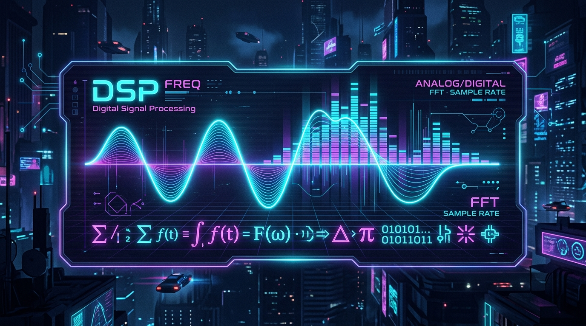
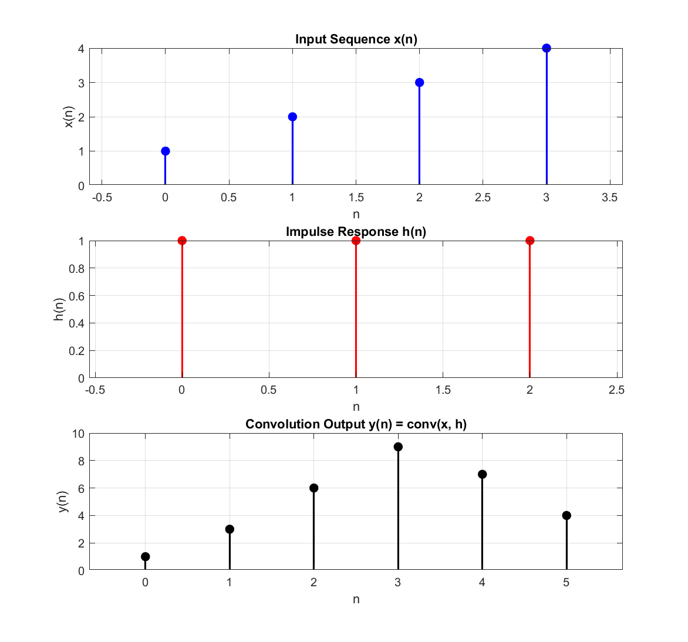
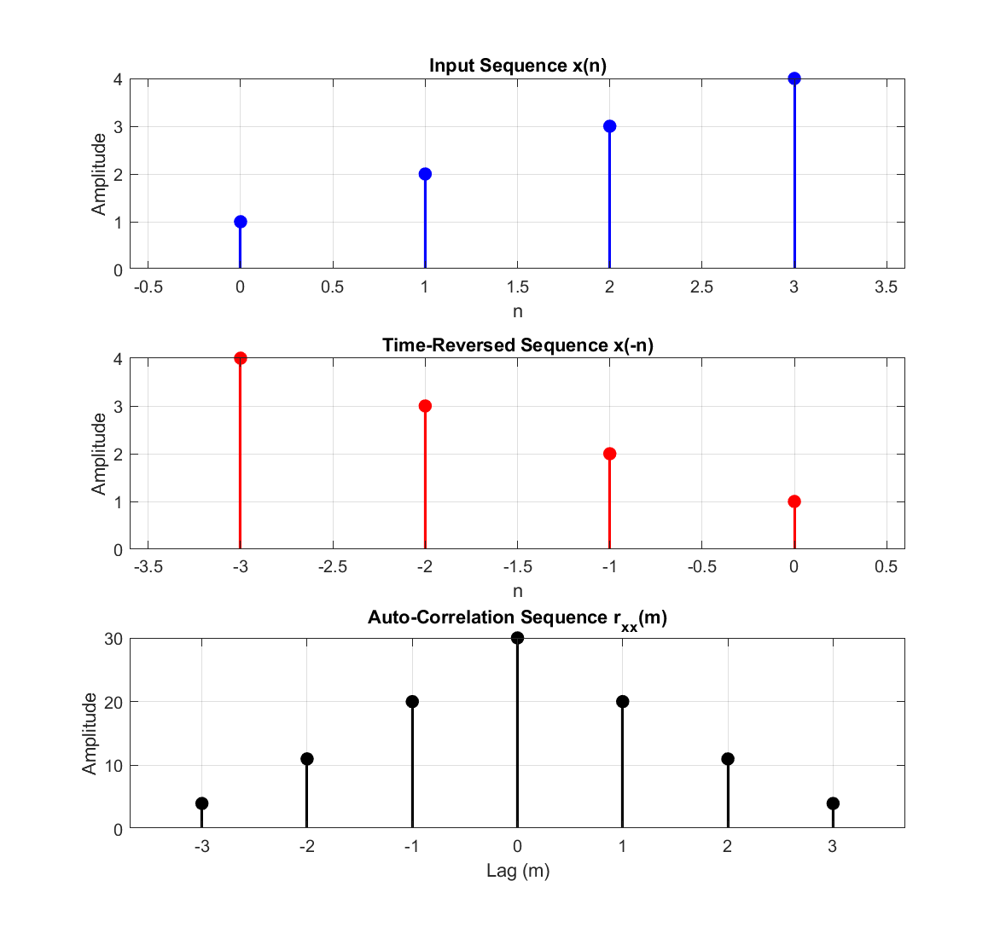
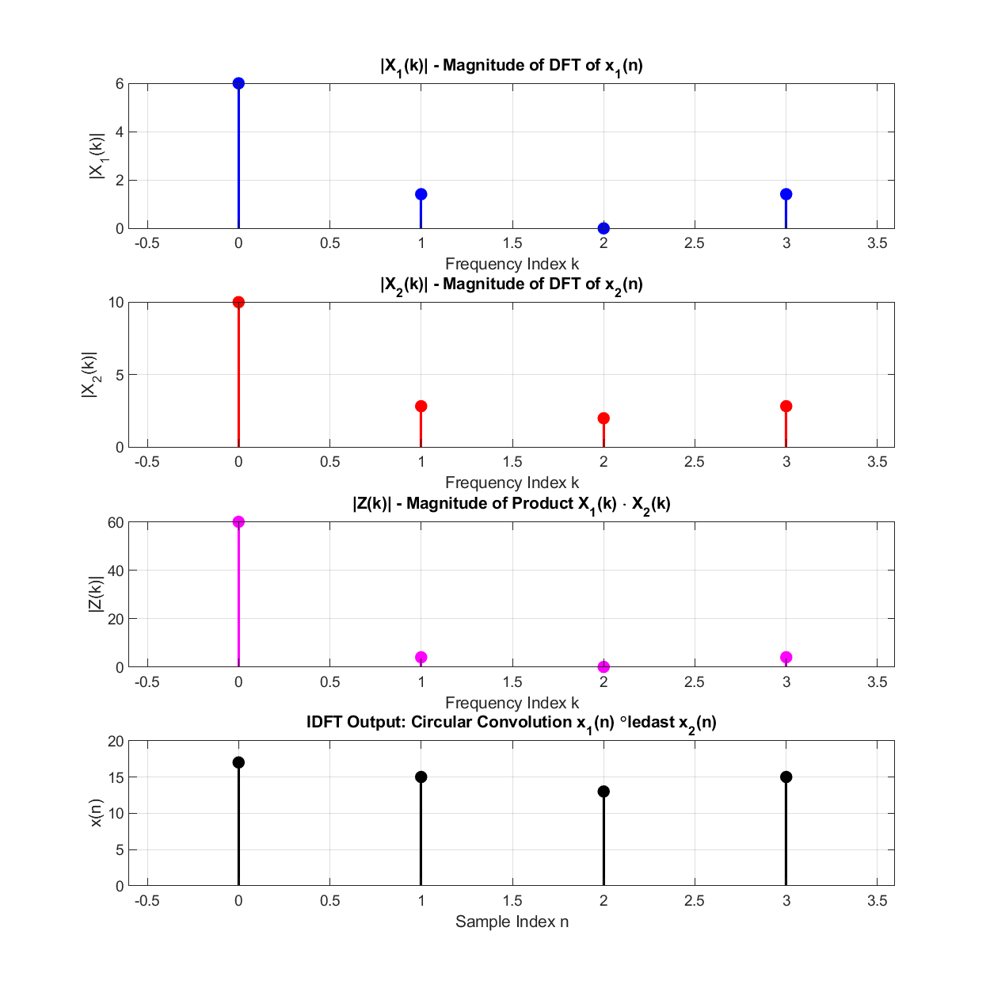
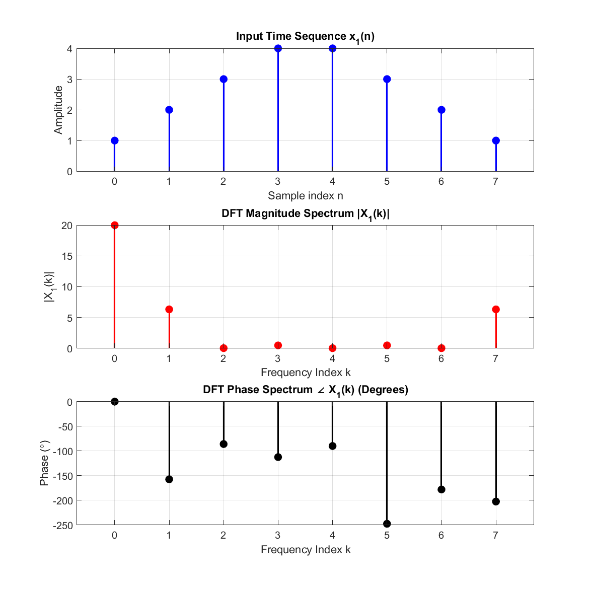

<div align="center">

# 🌐 Digital Signal Processing (DSP) Lab

<a href="https://git.io/typing-svg"></a>



[](https://www.mathworks.com/products/matlab.html)
[](https://opensource.org/licenses/MIT)
[]()
[]()

*A comprehensive, publication-ready repository of Digital Signal Processing (DSP) algorithms implemented in MATLAB. Every script is fully validated, equipped with automated batch-execution fallbacks, and paired with high-resolution visual plots aligned directly in its respective folder.*

<br/>

</div>

---

<div align="center">
  
## 🗺️ The DSP Learning Path


</div>

Mastering Digital Signal Processing requires a structured journey from basic continuous signals to complex frequency domain filtering. This repository is organized to guide you step-by-step through this transformation:

1. **Signals Foundations (`exp-01`, `exp-02`)**: Start by generating basic continuous and discrete waveforms. Understand the fundamental building blocks like unit impulses, steps, and ramps.
2. **Frequency Domain Analysis (`exp-03`, `exp-06`, `exp-07`)**: Transition from the time domain to the frequency domain using the Discrete-Time Fourier Transform (DTFT) and Discrete Fourier Transform (DFT). Visualize magnitude and phase spectra.
3. **System Operations (`exp-04`, `exp-05`)**: Learn how systems interact with signals through linear convolution, auto-correlation, and cross-correlation.
4. **Advanced Filtering & Reconstruction (`exp-08`, `exp-09`)**: Understand the equivalence of linear and circular convolution using the Fast Fourier Transform (FFT). Design filters and reconstruct signals efficiently.

---

## 🚀 How to Run

<details open>
<summary><b>1. One-Click Batch Execution (Recommended)</b></summary>
<br/>
To run every script and re-generate all output figures in their respective <code>outputs/</code> folders instantly:

```matlab
% In the repository root directory
run_all_experiments
```
Or from the system terminal (headless mode):
```bash
matlab -batch "run_all_experiments; exit;"
```
</details>

<details>
<summary><b>2. Running Individual Scripts</b></summary>
<br/>
Each script supports both interactive sequence entry and automated fallback defaults. For example:

```matlab
cd exp-04
convolution_linear
```
</details>

---

## 📑 Master File-to-Output Index

Rather than generic experiment numbers, this index maps every specific **source file**, its mathematical function, and its **respective generated output plot**.

| 📁 Folder | 📄 Source File | 🧠 DSP Concept / Operation | 📈 Respective Output File |
| :--- | :--- | :--- | :--- |
| **`exp-01/`** | [`signal_generation_basic.m`](./exp-01/signal_generation_basic.m) | Continuous & Discrete Waveform Synthesis | [`continuous_waveforms.png`](./exp-01/outputs/continuous_waveforms.png)<br>[`discrete_waveforms.png`](./exp-01/outputs/discrete_waveforms.png) |
| **`exp-02/`** | [`dtft_frequency_response.m`](./exp-02/dtft_frequency_response.m) | Elementary Discrete Signals (Loop Method) | [`dtft_frequency_response_signals.png`](./exp-02/outputs/dtft_frequency_response_signals.png) |
| **`exp-02/`** | [`dtft_plotting.m`](./exp-02/dtft_plotting.m) | Elementary Discrete Signals (Vector Method) | [`dtft_plotting_signals.png`](./exp-02/outputs/dtft_plotting_signals.png) |
| **`exp-03/`** | [`dtft_analysis_response.m`](./exp-03/dtft_analysis_response.m) | DTFT Magnitude & Phase Frequency Response | [`dtft_magnitude_phase_response.png`](./exp-03/outputs/dtft_magnitude_phase_response.png) |
| **`exp-04/`** | [`convolution_linear.m`](./exp-04/convolution_linear.m) | Linear Convolution via Nested Loops | [`convolution_linear_for_loop.png`](./exp-04/outputs/convolution_linear_for_loop.png) |
| **`exp-04/`** | [`convolution_linear_for_loop.m`](./exp-04/convolution_linear_for_loop.m) | Linear Convolution via MATLAB Built-in | [`convolution_builtin.png`](./exp-04/outputs/convolution_builtin.png) |
| **`exp-05/`** | [`auto_correlation.m`](./exp-05/auto_correlation.m) | Auto-Correlation & Signal Energy | [`auto_correlation.png`](./exp-05/outputs/auto_correlation.png) |
| **`exp-05/`** | [`cross_correlation.m`](./exp-05/cross_correlation.m) | Cross-Correlation between Sequences | [`cross_correlation.png`](./exp-05/outputs/cross_correlation.png) |
| **`exp-06/`** | [`dft_analysis.m`](./exp-06/dft_analysis.m) | Discrete Fourier Transform | [`dft_analysis.png`](./exp-06/outputs/dft_analysis.png) |
| **`exp-06/`** | [`dft_implementation.m`](./exp-06/dft_implementation.m) | Full DFT/IDFT Pipeline | [`dft_implementation.png`](./exp-06/outputs/dft_implementation.png) |
| **`exp-07/`** | [`dft_visualization.m`](./exp-07/dft_visualization.m) | $N$-Point DFT Magnitude & Phase Spectrum | [`dft_visualization.png`](./exp-07/outputs/dft_visualization.png) |
| **`exp-08/`** | [`fir_filter_design.m`](./exp-08/fir_filter_design.m) | Linear vs Circular Convolution via FFT | [`linear_vs_circular_convolution.png`](./exp-08/outputs/linear_vs_circular_convolution.png) |
| **`exp-09/`** | [`iir_filter_design.m`](./exp-09/iir_filter_design.m) | 8-Point FFT & Time Reconstruction | [`fft_8point.png`](./exp-09/outputs/fft_8point.png) |
| **`exp-09/`** | [`iir_filter_response.m`](./exp-09/iir_filter_response.m) | Multi-Point Linear vs Circular Verification | [`linear_circular_comparison.png`](./exp-09/outputs/linear_circular_comparison.png) |

---

<div align="center">

## 🖼️ Visual Gallery of Selected Generated Outputs

<table>
  <tr>
    <td align="center"><b>Continuous Waveforms (exp-01)</b></td>
    <td align="center"><b>Linear Convolution (exp-04)</b></td>
  </tr>
  <tr>
    <td></td>
    <td></td>
  </tr>
  <tr>
    <td align="center"><b>Auto-Correlation Analysis (exp-05)</b></td>
    <td align="center"><b>DFT & IDFT Implementation (exp-06)</b></td>
  </tr>
  <tr>
    <td></td>
    <td></td>
  </tr>
  <tr>
    <td align="center"><b>DFT Magnitude & Phase Spectra (exp-07)</b></td>
    <td align="center"><b>Linear vs Circular Convolution (exp-08)</b></td>
  </tr>
  <tr>
    <td></td>
    <td></td>
  </tr>
</table>

<br/>

**[⬆ Back to Top](#-digital-signal-processing-dsp-lab)**

</div>

---

## 🛠️ System Requirements
- **MATLAB**: R2018a or newer (Verified on **MATLAB R2024b**).
- **GNU Octave**: Compatible with GNU Octave 5.0+ (requires `signal` package for `sawtooth` / `square`).

---

## 📜 License
This project is open-source and available under the [MIT License](LICENSE).
