<div align="center">



[](https://www.mathworks.com/products/matlab.html)
[](https://opensource.org/licenses/MIT)

<br/>

*A curated, publication-ready repository of Digital Signal Processing algorithms implemented in MATLAB. Designed for simplicity, clarity, and computational accuracy.*

</div>

---

## 🧭 The Learning Path

Mastering Digital Signal Processing requires a structured journey from basic continuous signals to complex frequency domain filtering. This repository is organized to guide you step-by-step:

### 1. Signals Foundations
> **`exp-01`, `exp-02`**  
Start by generating basic continuous and discrete waveforms. Understand the fundamental building blocks like unit impulses, steps, and ramps.

### 2. Frequency Domain Analysis
> **`exp-03`, `exp-06`, `exp-07`**  
Transition from the time domain to the frequency domain using the Discrete-Time Fourier Transform (DTFT) and Discrete Fourier Transform (DFT). Visualize magnitude and phase spectra.

### 3. System Operations
> **`exp-04`, `exp-05`**  
Learn how systems interact with signals through linear convolution, auto-correlation, and cross-correlation.

### 4. Advanced Filtering & Reconstruction
> **`exp-08`, `exp-09`**  
Understand the equivalence of linear and circular convolution using the Fast Fourier Transform (FFT). Design filters and reconstruct signals efficiently.

---

## 🚀 How to Run

Every script is fully validated and equipped with automated batch-execution fallbacks. 

> [!NOTE]  
> Experimental output plots are automatically generated and saved locally in their respective `outputs/` folders when you run the scripts. They are strictly ignored from version control to keep this repository lightweight and clean.

<details open>
<summary><b>One-Click Batch Execution</b></summary>
<br/>
To run every script and re-generate all output figures instantly:

```matlab
% In the repository root directory
run_all_experiments
```
Or from the system terminal (headless mode):
```bash
matlab -batch "run_all_experiments; exit;"
```
</details>

<details>
<summary><b>Running Individual Scripts</b></summary>
<br/>
Each script supports both interactive sequence entry and automated fallback defaults. For example:

```matlab
cd exp-04
convolution_linear
```
</details>

---

## 📑 File-to-Concept Index

This index strictly maps every source file to its fundamental mathematical operation.

| Folder | Source File | Core Operation |
| :--- | :--- | :--- |
| **`exp-01/`** | `signal_generation_basic.m` | Continuous & Discrete Waveform Synthesis |
| **`exp-02/`** | `dtft_frequency_response.m` | Elementary Discrete Signals (Loop Method) |
| **`exp-02/`** | `dtft_plotting.m` | Elementary Discrete Signals (Vector Method) |
| **`exp-03/`** | `dtft_analysis_response.m` | DTFT Magnitude & Phase Frequency Response |
| **`exp-04/`** | `convolution_linear.m` | Linear Convolution via Nested Loops |
| **`exp-04/`** | `convolution_linear_for_loop.m`| Linear Convolution via MATLAB Built-in |
| **`exp-05/`** | `auto_correlation.m` | Auto-Correlation & Signal Energy |
| **`exp-05/`** | `cross_correlation.m` | Cross-Correlation between Sequences |
| **`exp-06/`** | `dft_analysis.m` | Discrete Fourier Transform |
| **`exp-06/`** | `dft_implementation.m` | Full DFT/IDFT Pipeline |
| **`exp-07/`** | `dft_visualization.m` | $N$-Point DFT Magnitude & Phase Spectrum |
| **`exp-08/`** | `fir_filter_design.m` | Linear vs Circular Convolution via FFT |
| **`exp-09/`** | `iir_filter_design.m` | 8-Point FFT & Time Reconstruction |
| **`exp-09/`** | `iir_filter_response.m` | Multi-Point Linear vs Circular Verification |

---

## 🛠️ System Requirements
- **MATLAB**: R2018a or newer (Verified on **MATLAB R2024b**).
- **GNU Octave**: Compatible with GNU Octave 5.0+ (requires `signal` package).

---

<div align="center">
  <small>Released under the <a href="LICENSE">MIT License</a>.</small>
</div>
