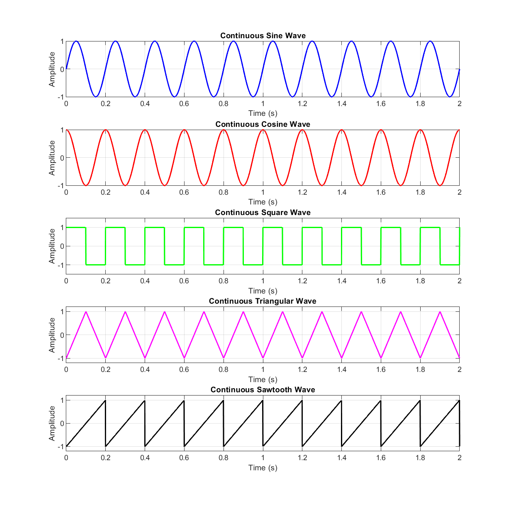
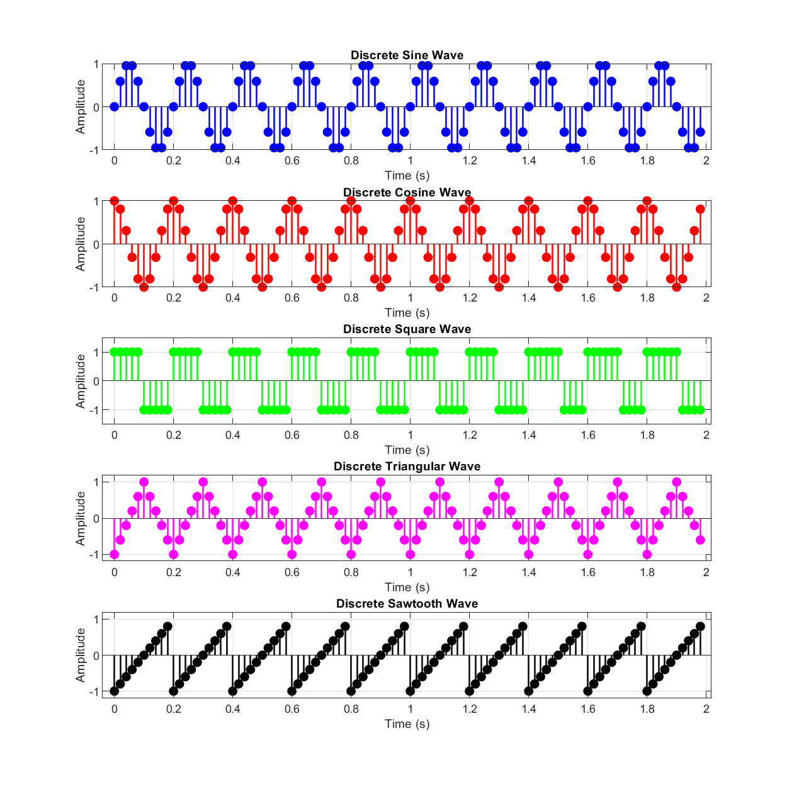

# Experiment 01 — Signal Generation

This module implements continuous-time and discrete-time signal generation using MATLAB.

---

## 📄 Files in this Folder

| File Name | Description | Output Plot |
| :--- | :--- | :--- |
| [`signal_generation_basic.m`](./signal_generation_basic.m) | Generates basic waveforms (Sine, Cosine, Square, Triangular, Sawtooth) in continuous and discrete domains. | [`continuous_waveforms.png`](./outputs/continuous_waveforms.png)<br>[`discrete_waveforms.png`](./outputs/discrete_waveforms.png) |

---

## 🔬 Script: `signal_generation_basic.m`

### 1. Mathematical Formulation & Signal Definitions
- **Continuous Sine Wave**: $y(t) = A \sin(2\pi f t)$
- **Continuous Cosine Wave**: $y(t) = A \cos(2\pi f t)$
- **Square Wave**: $y(t) = A \cdot \mathrm{sgn}(\sin(2\pi f t))$
- **Triangular Wave**: Periodic symmetric linear ramp with 50% duty cycle via `sawtooth(2*pi*f*t, 0.5)`
- **Sawtooth Wave**: Periodic ramp with 100% duty cycle via `sawtooth(2*pi*f*t)`
- **Discrete Sampling**: $t \rightarrow T = \frac{n}{f_{s,\mathrm{dis}}}$ for $n = 0, 1, \dots, N-1$

### 2. Parameters
- Continuous Sampling Rate ($f_s$): `1000 Hz`
- Discrete Sampling Rate ($f_{s,\mathrm{dis}}$): `50 Hz`
- Signal Frequency ($f$): `5 Hz`
- Amplitude ($A$): `1.0`
- Duration ($t_{\mathrm{end}}$): `2.0 s`
- Number of Discrete Samples ($N$): `100`

---

## 📊 Respective Outputs

### Output 1: Continuous Waveforms (`outputs/continuous_waveforms.png`)
Shows 5 periods per second of continuous-time Sine, Cosine, Square, Triangular, and Sawtooth signals over a 2-second time window.



### Output 2: Discrete Waveforms (`outputs/discrete_waveforms.png`)
Shows discrete sample values represented as stems sampled at $f_{s,\mathrm{dis}} = 50\text{ Hz}$ satisfying the Nyquist-Shannon criterion ($f_s \ge 2 f_{\mathrm{max}}$).



---

## 💻 How to Run
```matlab
% Inside exp-01 folder
signal_generation_basic
```
Outputs are automatically saved into the [`outputs/`](./outputs/) subfolder.