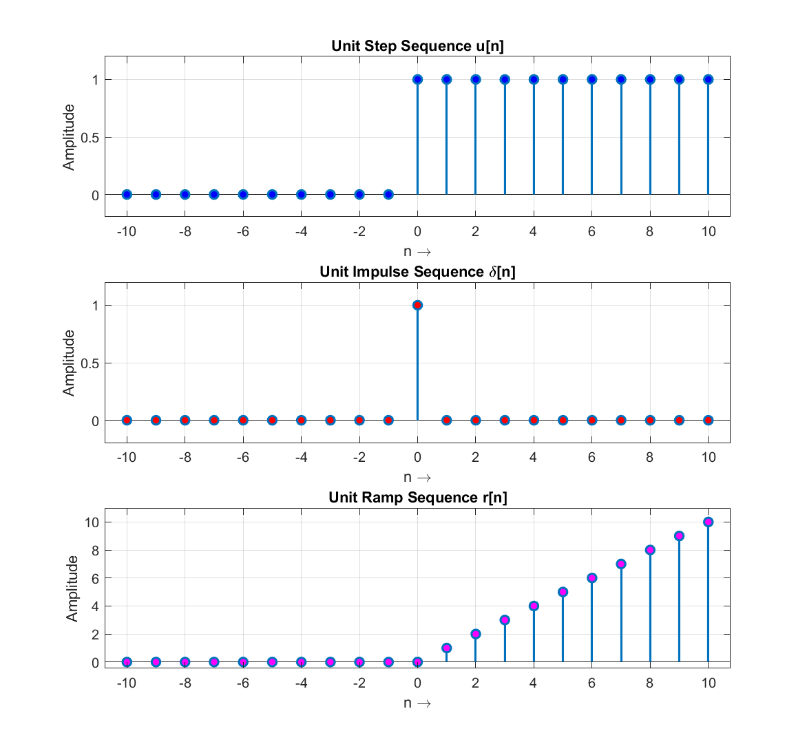
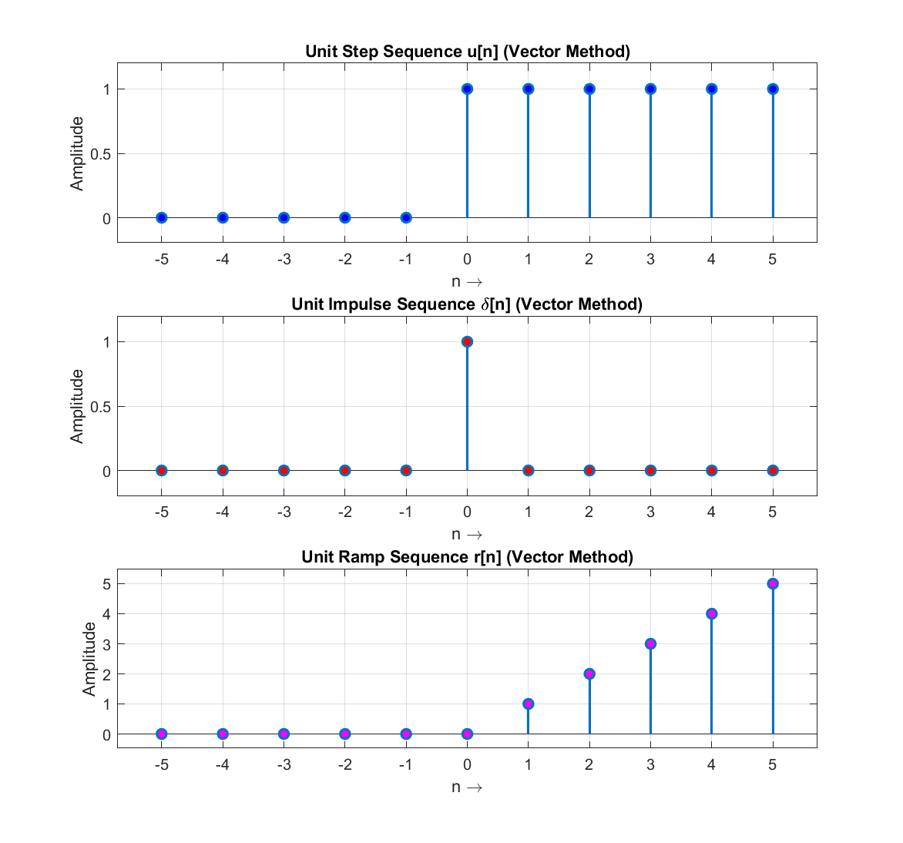

# Experiment 02 — Elementary Discrete-Time Signals

This module demonstrates the generation and visualization of fundamental discrete-time sequences: the **Unit Step sequence** $u[n]$, the **Unit Impulse sequence** $\delta[n]$, and the **Unit Ramp sequence** $r[n]$.

---

## 📄 Files in this Folder

| File Name | Method | Index Range | Output Plot |
| :--- | :--- | :--- | :--- |
| [`dtft_frequency_response.m`](./dtft_frequency_response.m) | Iterative generation via conditional `for` loops | $n \in [-10, 10]$ | [`dtft_frequency_response_signals.png`](./outputs/dtft_frequency_response_signals.png) |
| [`dtft_plotting.m`](./dtft_plotting.m) | Direct vector concatenation (`zeros` / `ones`) | $n \in [-5, 5]$ | [`dtft_plotting_signals.png`](./outputs/dtft_plotting_signals.png) |

> [!NOTE]
> *Historical Filename Clarification*: The filenames `dtft_frequency_response.m` and `dtft_plotting.m` represent the elementary discrete-time sequence generator implementations for basic signal analysis.

---

## 🔬 Script Details & Theory

### Signal Definitions:
1. **Unit Step Sequence**:
   $$u[n] = \begin{cases} 1, & n \ge 0 \\ 0, & n < 0 \end{cases}$$
2. **Unit Impulse (Dirac Delta) Sequence**:
   $$\delta[n] = \begin{cases} 1, & n = 0 \\ 0, & n \ne 0 \end{cases}$$
3. **Unit Ramp Sequence**:
   $$r[n] = n \cdot u[n] = \begin{cases} n, & n \ge 0 \\ 0, & n < 0 \end{cases}$$

---

## 📊 Respective Outputs

### 1. Output from `dtft_frequency_response.m`:
*Figure location: [`outputs/dtft_frequency_response_signals.png`](./outputs/dtft_frequency_response_signals.png)*

Generated over 21 sample points from $n = -10$ to $n = +10$ using condition-tested loops:



### 2. Output from `dtft_plotting.m`:
*Figure location: [`outputs/dtft_plotting_signals.png`](./outputs/dtft_plotting_signals.png)*

Generated over 11 sample points from $n = -5$ to $n = +5$ using direct MATLAB array concatenation:



---

## 💻 How to Run
```matlab
% Inside exp-02 folder
dtft_frequency_response
dtft_plotting
```
Outputs are automatically saved into the [`outputs/`](./outputs/) directory.