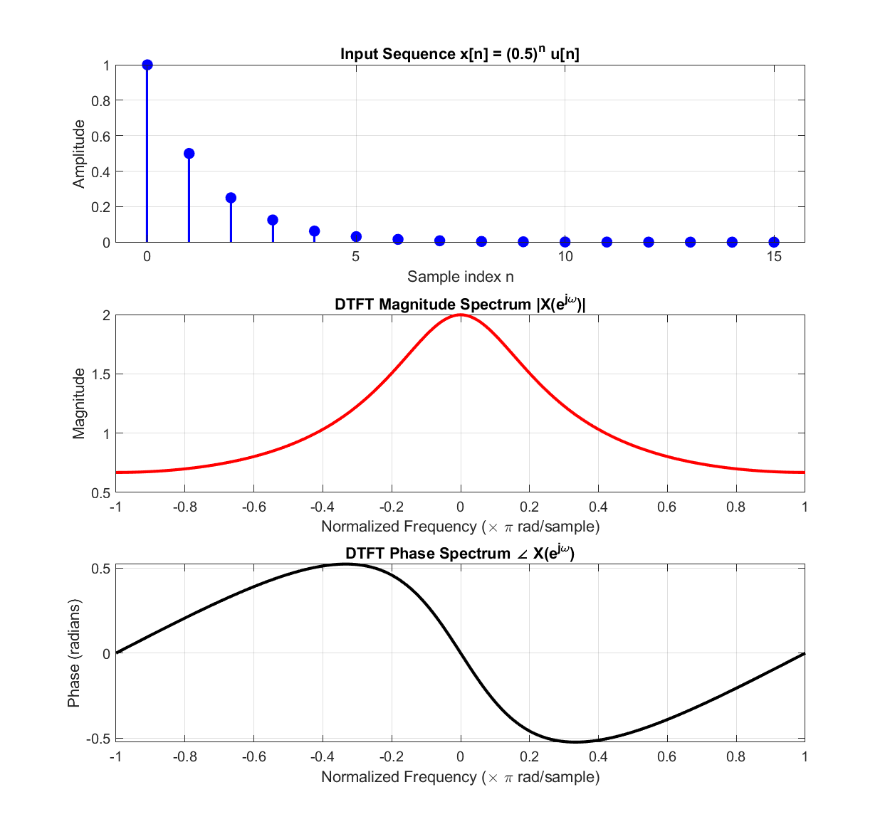

# Experiment 03 — Discrete-Time Fourier Transform (DTFT)

This module implements numerical computation and continuous frequency spectrum visualization of the **Discrete-Time Fourier Transform (DTFT)** for causal decaying exponential signals.

---

## 📄 Files in this Folder

| File Name | Description | Output Plot |
| :--- | :--- | :--- |
| [`dtft_analysis_response.m`](./dtft_analysis_response.m) | Computes the continuous-frequency DTFT magnitude and phase spectrum of $x[n] = a^n u[n]$ | [`dtft_magnitude_phase_response.png`](./outputs/dtft_magnitude_phase_response.png) |

---

## 🔬 Mathematical Background

The Discrete-Time Fourier Transform (DTFT) maps a discrete-time sequence $x[n]$ into a continuous, $2\pi$-periodic function of normalized angular frequency $\omega$:

$$X(e^{j\omega}) = \sum_{n=-\infty}^{\infty} x[n] e^{-j\omega n}$$

For a causal exponential sequence $x[n] = a^n u[n]$ ($|a| < 1$, with $a = 0.5$ and $N = 16$):
- **Magnitude Spectrum**: $|X(e^{j\omega})| = \frac{1}{\sqrt{1 - 2a\cos(\omega) + a^2}}$
- **Phase Spectrum**: $\angle X(e^{j\omega}) = -\arctan\left(\frac{a\sin(\omega)}{1 - a\cos(\omega)}\right)$

---

## 📊 Respective Outputs

### Output: `outputs/dtft_magnitude_phase_response.png`
- **Subplot 1**: Truncated input time-domain sequence $x[n] = (0.5)^n$ for $n = 0, 1, \dots, 15$.
- **Subplot 2**: Symmetrical low-pass magnitude spectrum $|X(e^{j\omega})|$ plotted over $\omega \in [-\pi, \pi]$ with peak at $\omega = 0$ ($|X(e^{j0})| \approx 2$).
- **Subplot 3**: Anti-symmetric continuous phase response $\angle X(e^{j\omega})$ in radians showing smooth phase transition.



---

## 💻 How to Run
```matlab
% Inside exp-03 folder
dtft_analysis_response
```
Outputs are automatically saved into the [`outputs/`](./outputs/) directory.