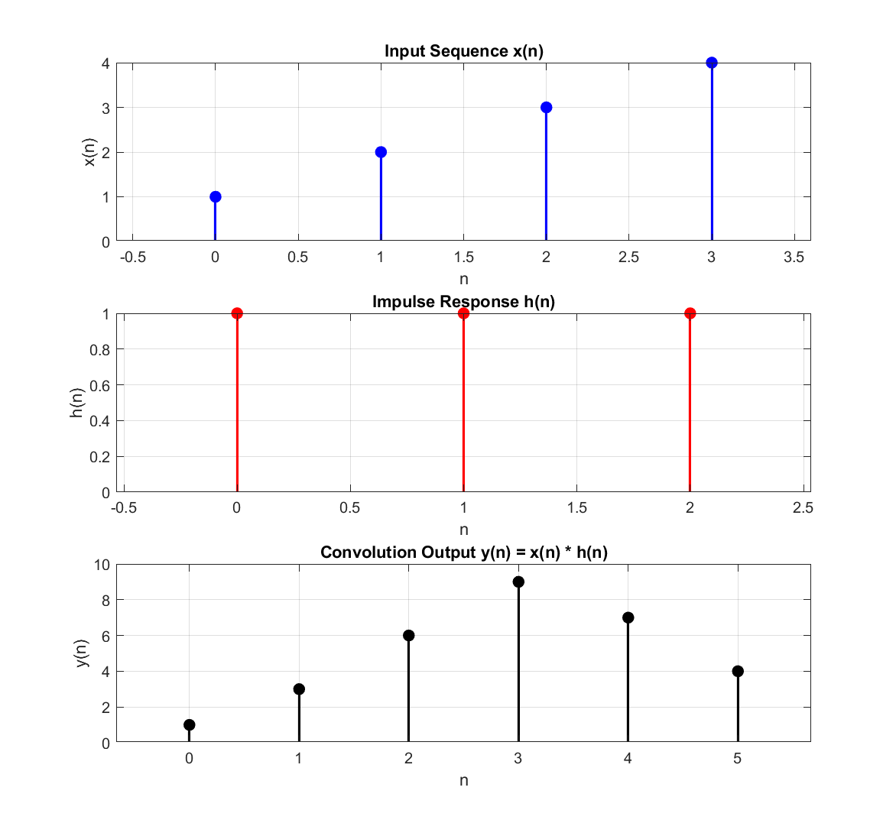

# Experiment 04 — Linear Convolution

This module demonstrates linear convolution of two discrete-time sequences using two approaches: a nested `for`-loop algorithm and MATLAB's built-in `conv()` function.

---

## 📄 Files in this Folder

| File Name | Implementation Method | Output Plot |
| :--- | :--- | :--- |
| [`convolution_linear.m`](./convolution_linear.m) | Algorithmic discrete convolution via zero-padding and nested `for` loops | [`convolution_linear_for_loop.png`](./outputs/convolution_linear_for_loop.png) |
| [`convolution_linear_for_loop.m`](./convolution_linear_for_loop.m) | High-level vector implementation using MATLAB's built-in `conv()` function | [`convolution_builtin.png`](./outputs/convolution_builtin.png) |

---

## 🔬 Mathematical Formulation

The linear convolution of an input sequence $x[n]$ of length $N_1$ with an impulse response $h[n]$ of length $N_2$ produces an output sequence $y[n]$ of length $N = N_1 + N_2 - 1$:

$$y[n] = x[n] * h[n] = \sum_{k=-\infty}^{\infty} x[k] h[n-k]$$

### Test Verification Example:
- **Input Sequence $x[n]$**: $[1, 2, 3, 4]$ ($N_1 = 4$)
- **Impulse Response $h[n]$**: $[1, 1, 1]$ ($N_2 = 3$)
- **Output Length**: $N = 4 + 3 - 1 = 6$
- **Expected Convolution Output**:
  - $y[0] = 1 \cdot 1 = 1$
  - $y[1] = 1 \cdot 1 + 2 \cdot 1 = 3$
  - $y[2] = 1 \cdot 1 + 2 \cdot 1 + 3 \cdot 1 = 6$
  - $y[3] = 2 \cdot 1 + 3 \cdot 1 + 4 \cdot 1 = 9$
  - $y[4] = 3 \cdot 1 + 4 \cdot 1 = 7$
  - $y[5] = 4 \cdot 1 = 4$
  $$\mathbf{y[n] = [1, 3, 6, 9, 7, 4]}$$

---

## 📊 Respective Outputs

### 1. Output from `convolution_linear.m` (Nested For-Loops):
*Figure location: [`outputs/convolution_linear_for_loop.png`](./outputs/convolution_linear_for_loop.png)*

```
Input sequence x(n):      1     2     3     4
Impulse response h(n):    1     1     1
Convolution output y(n) using for-loop: 1     3     6     9     7     4
```



### 2. Output from `convolution_linear_for_loop.m` (Built-in `conv`):
*Figure location: [`outputs/convolution_builtin.png`](./outputs/convolution_builtin.png)*

```
Input sequence x(n):      1     2     3     4
Impulse response h(n):    1     1     1
Convolution output y(n) using conv():   1     3     6     9     7     4
```


Both implementations achieve exact numeric congruence.

---

## 💻 How to Run
```matlab
% Inside exp-04 folder
convolution_linear
convolution_linear_for_loop
```
*Note: Both scripts prompt for input sequences interactively and provide defaults if run without arguments.*