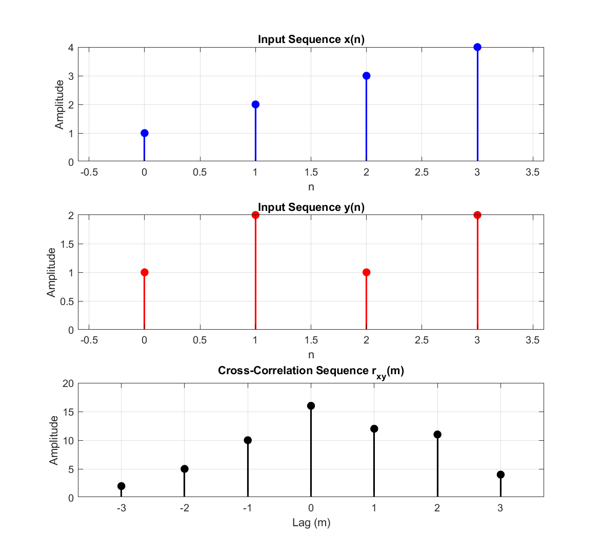

# Experiment 05 — Correlation (Auto & Cross)

This module implements correlation analysis of discrete-time sequences: **Auto-Correlation** $r_{xx}[m]$ and **Cross-Correlation** $r_{xy}[m]$ computed using convolution with time-reversed sequences.

---

## 📄 Files in this Folder

| File Name | Description | Output Plot |
| :--- | :--- | :--- |
| [`auto_correlation.m`](./auto_correlation.m) | Computes the auto-correlation sequence $r_{xx}[m] = x[m] * x[-m]$ over symmetrical lags | [`auto_correlation.png`](./outputs/auto_correlation.png) |
| [`cross_correlation.m`](./cross_correlation.m) | Computes the cross-correlation sequence $r_{xy}[m] = x[m] * y[-m]$ between two distinct signals | [`cross_correlation.png`](./outputs/cross_correlation.png) |

---

## 🔬 Mathematical Formulation

### 1. Auto-Correlation:
Quantifies the similarity of a signal with a delayed copy of itself:
$$r_{xx}[m] = \sum_{k=-\infty}^{\infty} x[k] x[k-m] = x[m] * x[-m]$$
- **Properties**:
  - Maximum at zero lag: $r_{xx}[0] = \sum_{n} |x[n]|^2 = E_x$ (Signal Energy).
  - Even symmetry: $r_{xx}[m] = r_{xx}[-m]$.

### 2. Cross-Correlation:
Measures the mutual similarity between two distinct sequences $x[n]$ and $y[n]$ as a function of lag $m$:
$$r_{xy}[m] = \sum_{k=-\infty}^{\infty} x[k] y[k-m] = x[m] * y[-m]$$

---

## 📊 Respective Outputs

### 1. Output from `auto_correlation.m`:
*Figure location: [`outputs/auto_correlation.png`](./outputs/auto_correlation.png)*

```
Input sequence x(n):          1     2     3     4
Time-reversed sequence x(-n): 4     3     2     1
Auto-correlation result r_xx: 4    11    20    30    20    11     4
Energy at lag 0 (E_x):        30
```


### 2. Output from `cross_correlation.m`:
*Figure location: [`outputs/cross_correlation.png`](./outputs/cross_correlation.png)*

```
Input sequence x(n):            1     2     3     4
Input sequence y(n):            1     2     1     2
Cross-correlation result r_xy:  2     5    10    16    12    11     4
Peak cross-correlation at lag 0: 16
```



---

## 💻 How to Run
```matlab
% Inside exp-05 folder
auto_correlation
cross_correlation
```
Outputs are automatically saved into the [`outputs/`](./outputs/) directory.