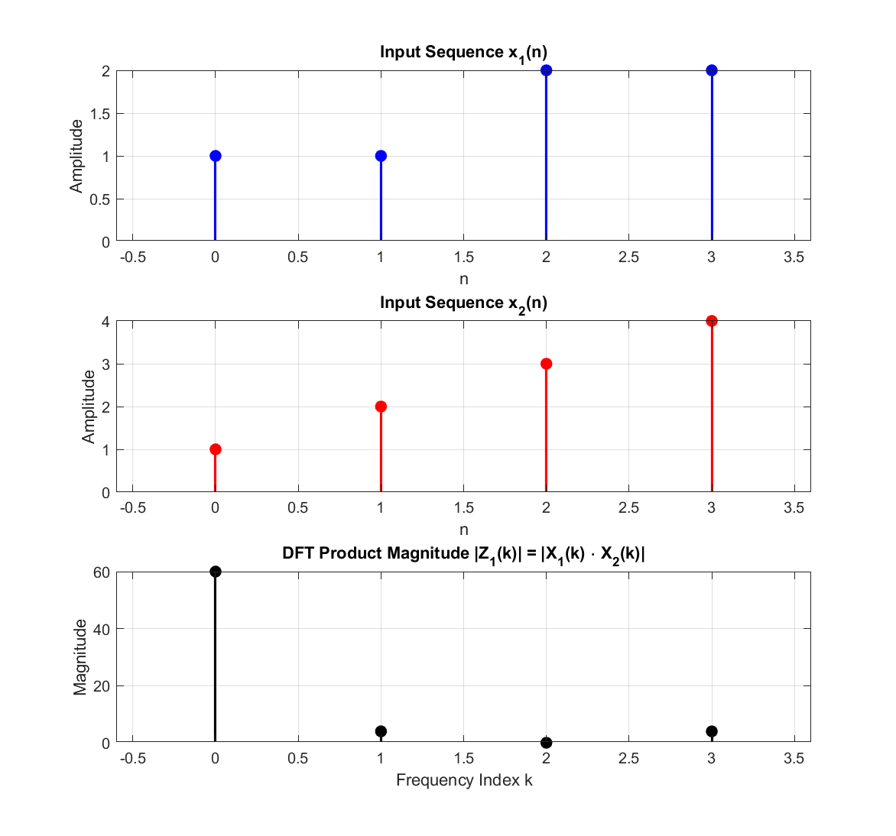

# Experiment 06 — Discrete Fourier Transform (DFT & IDFT)

This module implements the direct computation of the **Discrete Fourier Transform (DFT)** and **Inverse Discrete Fourier Transform (IDFT)**, verifying the fundamental frequency-domain property: multiplication in the frequency domain equals circular convolution in the time domain.

---

## 📄 Files in this Folder

| File Name | Description | Output Plot |
| :--- | :--- | :--- |
| [`dft_analysis.m`](./dft_analysis.m) | Computes DFT of sequences $x_1[n]$ and $x_2[n]$ and evaluates spectral product $|Z_1(k)| = |X_1(k) \cdot X_2(k)|$ | [`dft_analysis.png`](./outputs/dft_analysis.png) |
| [`dft_implementation.m`](./dft_implementation.m) | Full DFT and IDFT implementation: computes circular convolution $x_1[n] \circledast x_2[n]$ via spectral multiplication | [`dft_implementation.png`](./outputs/dft_implementation.png) |

---

## 🔬 Mathematical Formulation

### 1. Discrete Fourier Transform (DFT):
$$X[k] = \sum_{n=0}^{N-1} x[n] e^{-j \frac{2\pi}{N} k n}, \quad k = 0, 1, \dots, N-1$$

### 2. Inverse Discrete Fourier Transform (IDFT):
$$x[n] = \frac{1}{N} \sum_{k=0}^{N-1} X[k] e^{j \frac{2\pi}{N} k n}, \quad n = 0, 1, \dots, N-1$$

### 3. Circular Convolution Property:
$$x_1[n] \circledast x_2[n] \iff X_1[k] \cdot X_2[k]$$

---

## 📊 Respective Outputs

### 1. Output from `dft_analysis.m`:
*Figure location: [`outputs/dft_analysis.png`](./outputs/dft_analysis.png)*

```
Sequence x1:    1     1     2     2
Sequence x2:    1     2     3     4
DFT X1(k):      6.00 + 0.00i  -1.00 + 1.00i   0.00 - 0.00i  -1.00 - 1.00i
DFT X2(k):     10.00 + 0.00i  -2.00 + 2.00i  -2.00 - 0.00i  -2.00 - 2.00i
Product Z1(k): 60.00 + 0.00i   0.00 - 4.00i  -0.00 + 0.00i  -0.00 + 4.00i
```



### 2. Output from `dft_implementation.m`:
*Figure location: [`outputs/dft_implementation.png`](./outputs/dft_implementation.png)*

```
Sequence x1(n): 1     2     2     1
Sequence x2(n): 1     2     3     4
DFT X1(k):      6.00 + 0.00i  -1.00 - 1.00i   0.00 - 0.00i  -1.00 + 1.00i
DFT X2(k):     10.00 + 0.00i  -2.00 + 2.00i  -2.00 - 0.00i  -2.00 - 2.00i
Product Z(k):  60.00 + 0.00i   4.00 + 0.00i  -0.00 + 0.00i   4.00 + 0.00i
IDFT Output (Circular Convolution): 17    15    13    15
```


---

## 💻 How to Run
```matlab
% Inside exp-06 folder
dft_analysis
dft_implementation
```
Outputs are automatically saved into the [`outputs/`](./outputs/) directory.