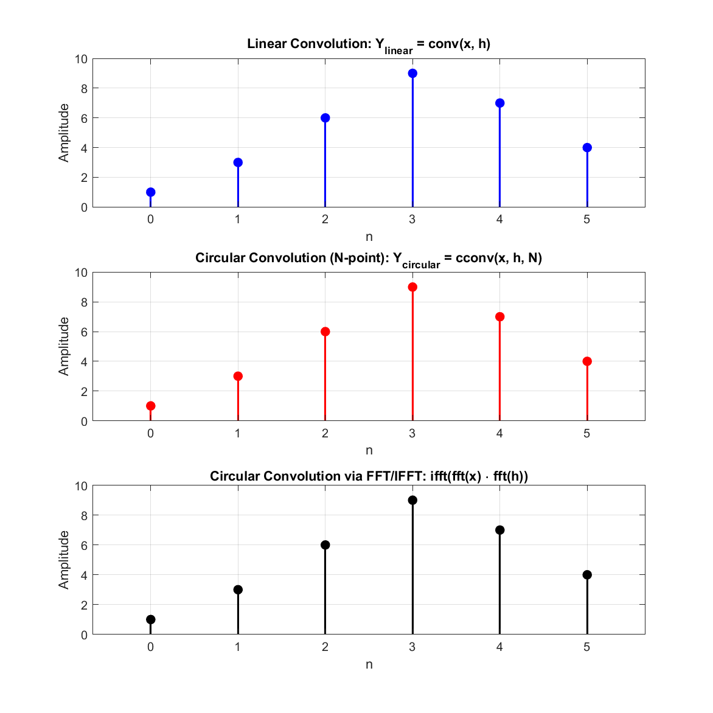

# Experiment 08 — Linear vs Circular Convolution Verification

This module demonstrates and verifies the equivalence between **Linear Convolution** and **Circular Convolution** when zero-padding satisfies the non-aliasing length $N = N_1 + N_2 - 1$, using MATLAB built-ins `conv()`, `cconv()`, and the Fast Fourier Transform (`fft` / `ifft`).

---

## 📄 Files in this Folder

| File Name | Description | Output Plot |
| :--- | :--- | :--- |
| [`fir_filter_design.m`](./fir_filter_design.m) | Computes and proves equivalence between `conv(x,h)`, `cconv(x,h,N)`, and `ifft(fft(x) .* fft(h))` | [`linear_vs_circular_convolution.png`](./outputs/linear_vs_circular_convolution.png) |

> [!NOTE]
> *Historical Filename Clarification*: The script is named `fir_filter_design.m` in the lab sequence and implements the foundational DSP concept of filter convolution equivalence (Linear vs Circular Convolution via FFT/IFFT).

---

## 🔬 Mathematical Formulation & Equivalence Principle

1. **Linear Convolution**:
   $$y_{\mathrm{linear}}[n] = \sum_{k} x[k] h[n-k], \quad \text{Length } N = N_1 + N_2 - 1$$

2. **Circular Convolution ($N$-point)**:
   $$y_{\mathrm{circular}}[n] = \sum_{k=0}^{N-1} x[k] h[(n-k) \pmod N]$$

3. **High-Speed Convolution Theorem (FFT Method)**:
   $$y[n] = \mathrm{IFFT}\{\mathrm{FFT}(x_{\mathrm{padded}}) \cdot \mathrm{FFT}(h_{\mathrm{padded}})\}$$
   When both sequences are zero-padded to at least $N \ge N_1 + N_2 - 1$, time-domain circular aliasing is prevented, making circular convolution identical to linear convolution.

---

## 📊 Respective Outputs

### Output from `fir_filter_design.m`:
*Figure location: [`outputs/linear_vs_circular_convolution.png`](./outputs/linear_vs_circular_convolution.png)*

```
Input Sequence x(n):              1     2     3     4
Impulse Response h(n):            1     1     1
Linear Convolution (conv):        1     3     6     9     7     4
Circular Convolution (cconv):     1     3     6     9     7     4
Circular Convolution via FFT/IFFT: 1     3     6     9     7     4

Result: Circular convolution (N-padded) matches with linear convolution!
```



- **Subplot 1**: Linear convolution output $y_{\mathrm{linear}}[n] = \mathrm{conv}(x, h)$.
- **Subplot 2**: $N$-point circular convolution output $y_{\mathrm{circular}}[n] = \mathrm{cconv}(x, h, N)$.
- **Subplot 3**: Frequency-domain circular convolution output via FFT and IFFT.

All three stems are identical sample-for-sample.

---

## 💻 How to Run
```matlab
% Inside exp-08 folder
fir_filter_design
```
Outputs are automatically saved into the [`outputs/`](./outputs/) directory.