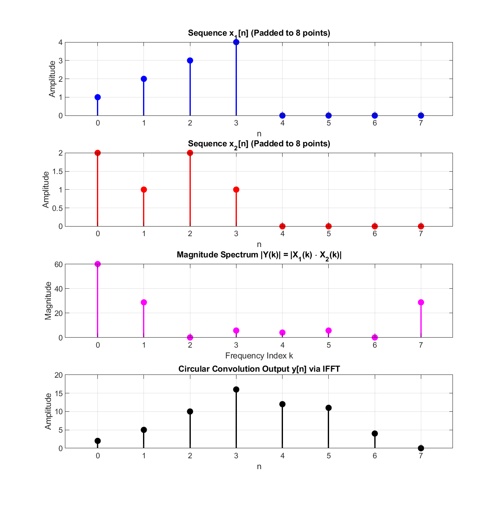
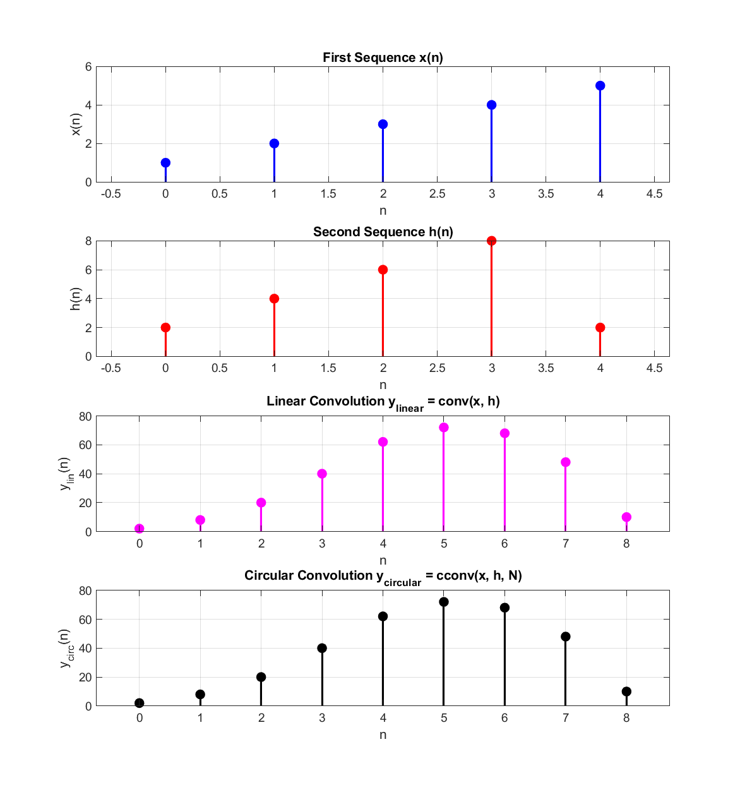

# Experiment 09 — 8-Point FFT/IFFT & Convolution Comparison

This module evaluates **8-point Fast Fourier Transform (FFT)**, circular convolution in the frequency domain with **Inverse Fast Fourier Transform (IFFT)**, and comprehensive verification of linear vs circular convolution.

---

## 📄 Files in this Folder

| File Name | Description | Output Plot |
| :--- | :--- | :--- |
| [`iir_filter_design.m`](./iir_filter_design.m) | Computes 8-point FFT of zero-padded sequences, performs spectral product, and inverts via IFFT | [`fft_8point.png`](./outputs/fft_8point.png) |
| [`iir_filter_response.m`](./iir_filter_response.m) | Compares linear convolution and $N$-point circular convolution for 5-element sequences | [`linear_circular_comparison.png`](./outputs/linear_circular_comparison.png) |

> [!NOTE]
> *Historical Filename Clarification*: The filenames `iir_filter_design.m` and `iir_filter_response.m` were labeled for the IIR lab section and implement the 8-point FFT computation and linear/circular convolution response comparison.

---

## 🔬 Mathematical Background

### 1. Radix-2 Fast Fourier Transform (FFT):
Computes the DFT with computational complexity $O(N \log_2 N)$ instead of direct DFT $O(N^2)$:
$$X[k] = \sum_{n=0}^{N-1} x[n] W_N^{kn}, \quad W_N = e^{-j \frac{2\pi}{N}}$$

### 2. Frequency-Domain Circular Convolution:
$$y[n] = \mathrm{IFFT}_N\{\mathrm{FFT}_N(x_1) \cdot \mathrm{FFT}_N(x_2)\}$$

---

## 📊 Respective Outputs

### 1. Output from `iir_filter_design.m`:
*Figure location: [`outputs/fft_8point.png`](./outputs/fft_8point.png)*

```
Input Sequence x1 (padded to 8): 1     2     3     4     0     0     0     0
Input Sequence x2 (padded to 8): 2     1     2     1     0     0     0     0
8-point FFT of x1: 10.00 + 0.00i  -0.41 - 7.24i  -2.00 + 2.00i   2.41 - 1.24i ...
8-point FFT of x2:  6.00 + 0.00i   2.00 - 3.41i   0.00 + 0.00i   2.00 + 0.59i ...
Circular Convolution via IFFT y[n]: 2.00  5.00  10.00  16.00  12.00  11.00  4.00  0.00
```



### 2. Output from `iir_filter_response.m`:
*Figure location: [`outputs/linear_circular_comparison.png`](./outputs/linear_circular_comparison.png)*

```
Input sequence x:  1     2     3     4     5
Input sequence h:  2     4     6     8     2
Linear convolution output (conv):          2     8    20    40    62    72    68    48    10
Circular convolution output (cconv, N=9):  2     8    20    40    62    72    68    48    10

Result: Circular convolution matches with linear convolution!
```



---

## 💻 How to Run
```matlab
% Inside exp-09 folder
iir_filter_design
iir_filter_response
```
Outputs are automatically saved into the [`outputs/`](./outputs/) directory.